## `whoami`

B.Tech Biomedical Engineering at **BVRIT**, class of '27 — but most of what I do is build the thing
rather than write about it.

The through-line is **turning a biological signal into something a machine can act on**, and then
building every layer that takes to work: the electrode front-end, the firmware, the classifier, the
real-time pipeline, and the interface a clinician or a trainee actually touches. That means I end up
in EEG one week, C firmware the next, and Unity after that — not because I'm unfocused, but because a
working neural interface needs all three and nobody hands you the middle layers.

Currently building mixed-reality industrial training at **[Applix](https://github.com/applix-ai)**,
and a clinical data-capture platform for the emergency department at **NIMS Hyderabad**.

## The garage

**Signals & neuro**

MNE · OpenBCI / Cyton · Lab Streaming Layer · PsychoPy · SSVEP · mVEP · motor imagery

**Hardware & firmware**

ESP32 · LTspice · Multisim · analogue front-ends · sensor integration · rapid prototyping

**Spatial & 3D**

Meta Quest 3 · OpenXR · passthrough MR · hand &amp; controller interaction

**Web & deployment**

## Telemetry

<picture>
  <source media="(prefers-color-scheme: dark)" srcset="https://raw.githubusercontent.com/BhavithParna/BhavithParna/output/snake-dark.svg">
  <source media="(prefers-color-scheme: light)" srcset="https://raw.githubusercontent.com/BhavithParna/BhavithParna/output/snake.svg">
  
</picture>

Most of my commits land in private repos, so the graph above is the honest floor, not the ceiling.

<table>
<tr>
<td valign="middle">

### Downhill

Most of that stack started as something I had no business attempting yet — no EEG background when I started with EEG, no Unity when the headset arrived. The trick has never been knowing the road. It's running it enough times that you stop braking where you don't need to.

> *"There's no such thing as a car that can't be beaten."*

</td>
<td width="240" align="right" valign="middle">

</td>
</tr>
</table>

