## `> ls ./garage`

## `> cat telemetry`

<picture>
  <source media="(prefers-color-scheme: dark)" srcset="https://raw.githubusercontent.com/BhavithParna/BhavithParna/output/snake-dark.svg">
  <source media="(prefers-color-scheme: light)" srcset="https://raw.githubusercontent.com/BhavithParna/BhavithParna/output/snake.svg">
  
</picture>

## `> ./drive`

<table width="100%">
<tr>
<td valign="middle">

> *"There's no such thing as a car that can't be beaten."*

 

</td>
<td width="250" align="right" valign="middle">

</td>
</tr>
</table>

<code>EOF</code>

